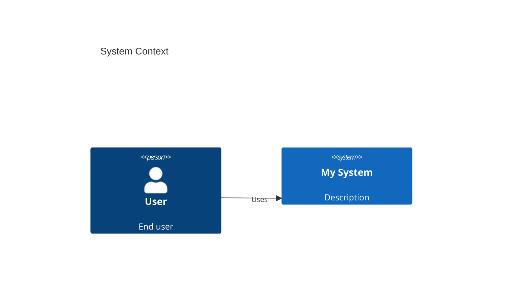
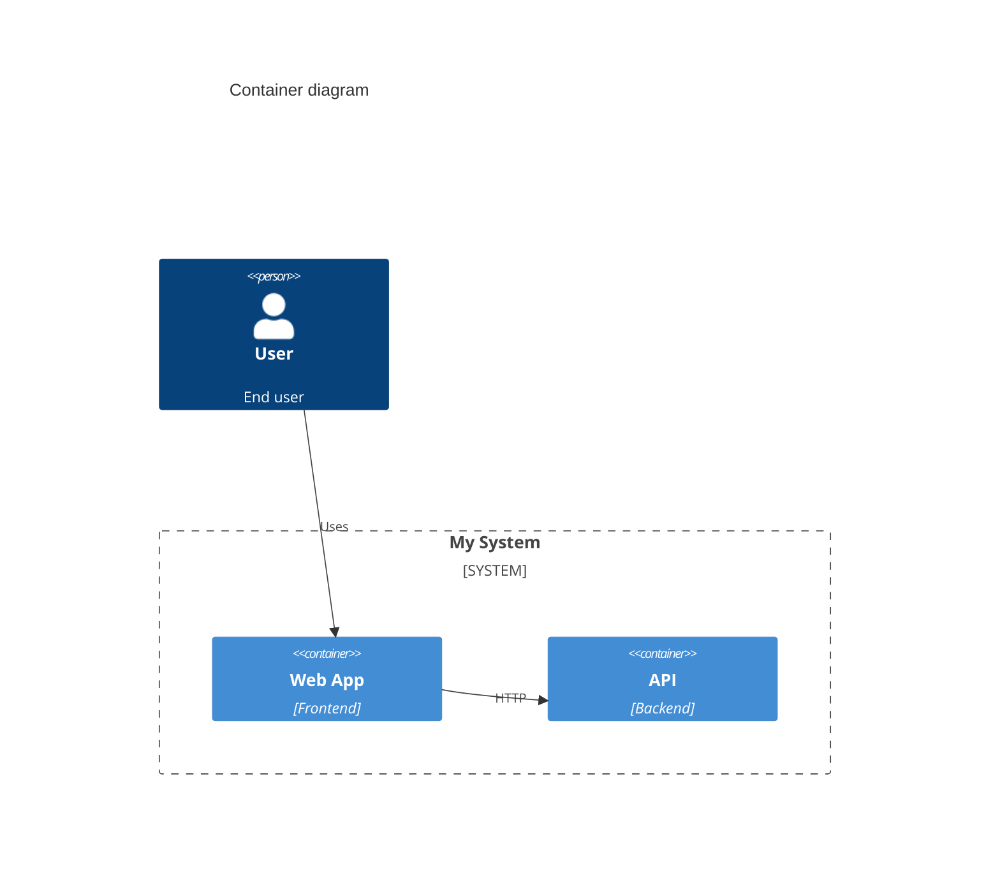

# Diagrams — which tool when

Use when the user asks how to draw or maintain architecture or deployment diagrams, or which format to use.

## Recommendation summary

| Goal | Prefer | Alternative |
|------|--------|-------------|
| C4 software architecture, single source of truth, linked to !docs/!adrs | **Structurizr DSL** → export to Mermaid/PlantUML/HTML | Mermaid C4 in Markdown (no Structurizr) |
| View diagrams without Java/Docker | **Mermaid C4** in Markdown (templates in this skill) | Structurizr export to Mermaid then embed |
| Deployment / infrastructure (cloud, K8s) | **mingrammer/diagrams** (Python) or Structurizr C4 deployment view | Mermaid for simple boxes |

## 1. Structurizr (primary for C4 + wiki)

- **Use for:** C4 model (context, container, component, deployment), one source of truth, with `!docs` and `!adrs`.
- **View:** Structurizr vNext `local` command, or **export** to Mermaid/PlantUML/HTML and embed in Markdown.
- **Dependencies:** Structurizr vNext (see [docs](https://docs.structurizr.com/commands)); Java or Docker typical.

## 2. Mermaid C4 (no extra runtime)

- **Use for:** C4 diagrams directly in Markdown when the user does not want to run Structurizr; good for GitHub/GitLab, VS Code, Cursor.
- **Limitations:** C4 support is experimental; fewer options than Structurizr (e.g. no sprites, manual layout).
- **Templates** (user can copy and adapt):

**System context:**

**Container:**

**Component:** use `C4Component` and `Container_Boundary` for components inside a container.

- **Reference:** [Mermaid C4](https://mermaid.js.org/syntax/c4.html).

## 3. mingrammer/diagrams (deployment / infra)

- **Use for:** Deployment and infrastructure diagrams (AWS, GCP, Azure, K8s, etc.), not for C4 logical architecture.
- **Output:** Python script generates PNG/SVG; commit images or regenerate in CI.
- **Dependencies:** Python, `diagrams` package, Graphviz.
- **Role in plugin:** Optional. Recommend as a **second tier** for infra/deployment only; keep C4 (Structurizr or Mermaid) for software structure. No mandatory setup in the plugin — document in README or this skill.

## When the user has no Structurizr

Suggest: (1) use **Mermaid C4** in Markdown with the templates above, or (2) install Structurizr vNext and use `export -format mermaid` to generate Mermaid from the DSL, then embed in docs.
